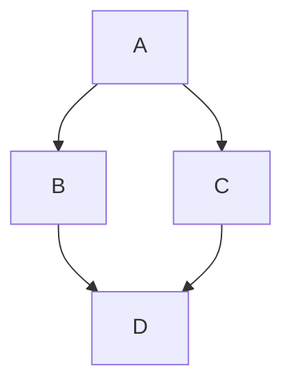

# Purchase
# Pick Up
# System Checks

I recieved a large lot that was a mixed bag of items. Some where towers some were laptops. I knew that there may be missing components broken items, so I would need a system to check every machine. I set up a table in my garage with a power strip, one of the many monitors that came in the lot, and several other items to facillitate testing. I made a simple check off list for ensuring consistency and saving heartache down the road. Here it is:

## Computer Inspection Checklist
### Basic Information
- [ ] **Model & Make:** 
- [ ] **Serial Number:**

### Physical Inspection
- [ ] **Exterior Condition:** (Look for dents, scratches, etc.)
- [ ] **Screen Condition:** (Check for cracks, dead pixels, etc.)
- [ ] **Keyboard and Trackpad Condition:** 
- [ ] **Ports and Connections:** (USB, HDMI, etc.)

### Hardware Components
- [ ] **CPU Type & Speed:** 
- [ ] **RAM Size:**
- [ ] **Storage Type & Capacity:** (HDD/SSD)
- [ ] **Graphics Card:**
- [ ] **Battery Health:** (If applicable)
- [ ] **Power Supply & Cables:** 

### Functionality Tests
- [ ] **Power On/Off Test:**
- [ ] **Operating System Boot-Up:**
- [ ] **Sound System Test: (Speakers and Mic)**
- [ ] **Display Test: (Brightness, Color Accuracy)**
- [ ] **Keyboard and Trackpad Functionality:**
- [ ] **Network Connectivity: (Wi-Fi, Ethernet)**
- [ ] **USB and Other Ports Functionality:**

### Software Checks
- [ ] **Operating System Version:**
- [ ] **Installed Software List:**
- [ ] **Antivirus & Security Check:**
- [ ] **System Updates:**

### Additional Notes
- [ ] **Special Features: (e.g., Touchscreen, Convertible)**
- [ ] **Other Observations:**

### Final Assessment
- [ ] **Overall Working Condition:**
- [ ] **Recommended Actions: (Repair, Upgrade, etc.)**
- [ ] **Estimated Value:**

I also determined that I needed a script to automate the process of checking the hardware. I created a simple script on a thumb drive I made using [Ventoy](https://www.ventoy.net/en/index.html) This allowed for me to test machines with all components present. I figured I would deploy the script using either [knoppix](https://www.knopper.net/knoppix/index-en.html) or [rasbian](https://www.raspberrypi.com/software/) given they are lightweight and are both on my [Ventoy](https://www.ventoy.net/en/index.html) drive. 

Immediately I bumped into 2 issues. The towers were vile, so I had to scrub them and vaccum out the dust bunnies. The second was that there was no hard drive. I have done small data recovery projects for people I know and relatives helping to recover lost photos of loved ones and important documents. This is important as I had quite a few old hard drives [lying around](https://www.thingiverse.com/thing:3399582). I needed to ensure that there was no data on it so I plugged it in using a usb to sata cable. Then I would use an absoulutely wonderful tool called [testdisk](https://www.cgsecurity.org/). Now I had a drive to work with. 

# Material Sourcing

After checking all the machines out and looking over that box of components I said that I would use one day and finnaly did, this is what I need:
- Chargers and power cables
- Bulk hard disks
- Proprietary Hard Drive sleeves/covers.

# Configuration

# Implementation
